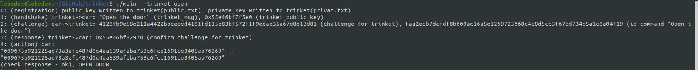

# Эмуляция работы автомобильного брелка
### Описание программы
Программа, эмулирующая работу автомобильного брелка, открывающего машину с использованием ЭЦП, в условиях когда канал связи полностью доступен любому прослушивающему.

### Описание алгоритма решения
0. Генерируются приватный и публичный ключ брелка автомобиля (ключи записываются в файлы).
1. Брелок отправляет handshake запрос автомобилю с просьбой открыть дверь ("Open the door").
2. Автомобиль отправляет challenge = hash(random) (SHA-256) брелку с требованием подписать данный хеш (ЭЦП) своим приватным ключом.
3. Брелок выполняет ЭЦП challenge и отправляет данные обратно автомобилю.
4. Автомобиль проверяет ЭЦП брелка его публичным ключом, в случае корректности ЭЦП открывает дверь.

Программа устойчива к атакам извне (повторению прослушиваемых данных в том числе и в течение большого времени и попыток), так как challenge автомобиля каждый раз генерируется случайным образом.

### Конфигурация
Программа получает на вход два ключевых слова `--trinket` и `open`. 

### Сборка
Чтобы собрать проект в командной строке напишите: 
> g++ -o main trinket.cpp -lssl -lcrypto

### Запуск
Чтобы запустить проект в командной строке напишите: 
> ./main --trinket open

### Пример работы программы

### Используемые несистемные библиотеки
openssl (https://www.openssl.org/)
